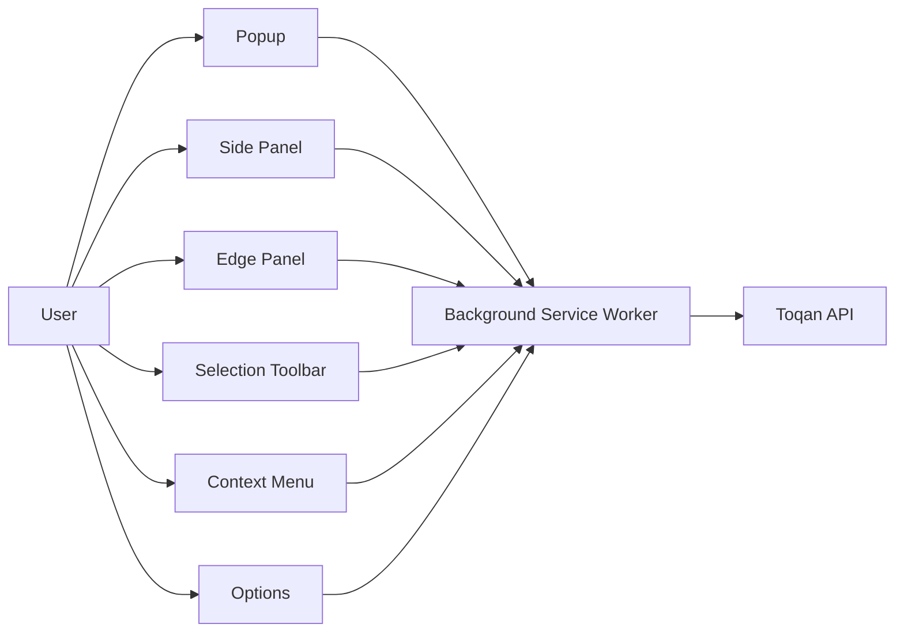
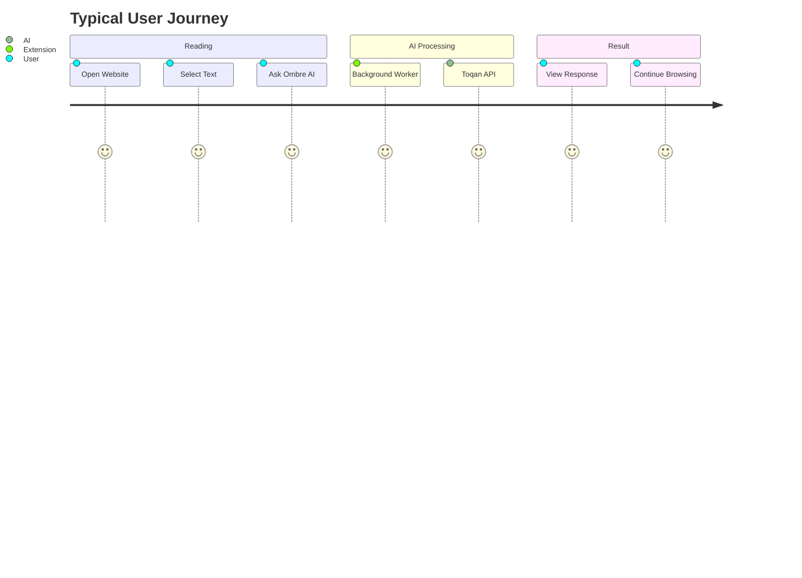
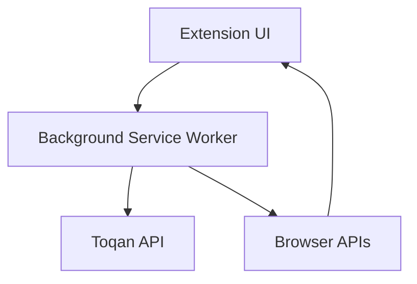
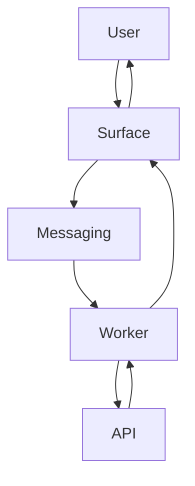

# 01 · Project Overview

> **Ombre AI** is a modern **Manifest V3 Chrome Extension** that brings an AI-powered assistant directly into the browsing experience. Powered by the **Toqan API**, the extension enables users to interact with AI wherever they read, write, or select text on the web without leaving their current page.

Rather than existing as a single application window, Ombre AI is composed of multiple coordinated extension surfaces that share a centralized messaging architecture and a single networking layer. Every interaction—whether initiated from the popup, side panel, context menu, or injected page interface—flows through the Background Service Worker before reaching the Toqan API.

This document provides a high-level overview of the project, its architecture, goals, and design philosophy.

---

# Vision

The primary objective of Ombre AI is to make AI assistance feel like a native part of web browsing instead of a separate destination.

Instead of requiring users to open another website or application, Ombre AI is always available exactly where work happens:

- Reading documentation
- Writing emails
- Editing documents
- Researching information
- Summarizing articles
- Rewriting content
- Asking contextual questions
- Brainstorming ideas

The extension is designed to reduce context switching while providing a fast, consistent, and intelligent user experience across the entire web.

---

# Project Architecture at a Glance



All user interactions ultimately follow the same architecture:

> **Surface → Background Service Worker → Toqan API → Background Service Worker → Surface**

This design keeps networking centralized while allowing every interface to remain lightweight and independent.

---

# Extension Surfaces

Ombre AI consists of six user-facing experiences, each optimized for a different workflow.

| Surface | Purpose |
|----------|---------|
| **Popup** | Compact chat window opened from the browser toolbar. |
| **Side Panel** | Persistent AI workspace with conversation history. |
| **Options Page** | Extension configuration and API settings. |
| **Edge Panel** | Floating AI assistant injected into every webpage. |
| **Context Menu** | Ask AI about selected text directly from the browser's right-click menu. |
| **Selection Toolbar** | Floating action bar displayed above selected text with quick AI actions. |

Each surface provides a specialized interaction while sharing the same backend infrastructure.

---

# User Experience



The extension minimizes interruption by allowing users to stay within their existing workflow.

---

# Technology Stack

```mermaid
mindmap

  root((Ombre AI))

    Frontend

      React

      TypeScript

      Tailwind CSS

      Shadow DOM

    Browser

      Chrome Extension

      Manifest V3

      Service Worker

      Runtime Messaging

    AI

      Toqan API

    Storage

      chrome.storage

    Build

      Vite

      npm
```

---

# System Responsibilities



The project intentionally separates responsibilities across execution contexts.

| Component | Responsibility |
|------------|----------------|
| Extension Surfaces | User interface |
| Content Scripts | DOM interaction |
| Background Service Worker | Networking, routing, authentication |
| Browser APIs | Storage, messaging, tabs |
| Toqan API | AI inference |

---

# Design Goals

The project is guided by several engineering and user experience goals.

## Universal Accessibility

AI assistance should never be more than one or two interactions away.

Whether the user is reading an article, composing an email, or writing documentation, Ombre AI should be immediately available.

---

## Consistent Experience

Although the extension spans multiple rendering environments—including React applications and Shadow DOM interfaces—it should behave as a single cohesive product.

This consistency includes:

- typography
- spacing
- animations
- interaction patterns
- keyboard shortcuts
- visual identity

---

## Security

The extension follows a strict networking model.

- No API keys are exposed to web pages.
- No UI performs direct API requests.
- Authentication remains centralized.
- Network communication occurs exclusively inside the Background Service Worker.

---

## Performance

The extension is designed to remain lightweight.

Objectives include:

- minimal startup cost
- lazy initialization
- efficient runtime messaging
- responsive interactions
- low memory overhead

---

## Reliability

Modern websites present unique engineering challenges.

The extension is designed to function reliably across:

- Single Page Applications
- Dynamic DOM updates
- Rich text editors
- Embedded iframes
- Shadow DOM environments
- Strict Content Security Policies (CSP)
- Extension reloads
- Hostile page CSS

---

# Architectural Philosophy



Every feature follows the same architectural pattern.

Rather than allowing each UI to implement networking independently, the extension centralizes communication inside the Background Service Worker.

Benefits include:

- cleaner architecture
- easier debugging
- consistent error handling
- centralized authentication
- reusable networking logic
- simplified feature development

---

# Project Goals

The long-term objectives of Ombre AI are:

- Deliver AI assistance anywhere on the web within two interactions or fewer.
- Maintain a unified experience across all extension surfaces.
- Centralize networking through a single service layer.
- Provide a scalable architecture that supports future AI capabilities.
- Build an extension resilient to modern web technologies such as iframes, Shadow DOM, and dynamic applications.
- Create an intuitive browsing companion that feels native to Chrome.

---

# Non-Goals (MVP)

The current version intentionally excludes several features in order to focus on delivering a stable and polished core experience.

### User Accounts

The extension does not provide its own authentication system or user management.

Configuration is stored using Chrome's built-in storage APIs.

---

### Self-Hosted Backend

There is no custom backend infrastructure.

The Background Service Worker functions as the application's networking layer while the Toqan API provides AI services.

---

### Database

No project-owned database exists.

Persistent configuration relies on:

- `chrome.storage.local`
- `chrome.storage.sync`

---

### Multi-Device Synchronization

Only Chrome's native synchronization capabilities are supported.

Additional cloud synchronization is outside the scope of the MVP.

---

### Automated Testing

An automated testing suite has not yet been implemented.

A comprehensive testing strategy—including unit, integration, and end-to-end testing—is documented separately in **08 · Testing Strategy**.

---

# Future Roadmap

Potential future enhancements include:

- conversation synchronization
- user authentication
- AI workflow automation
- browser history awareness
- document summarization
- semantic search
- multi-model AI support
- offline request queueing
- telemetry and analytics
- enterprise deployment capabilities

---

# Summary

Ombre AI is a modern, service-oriented Chrome extension designed to make AI assistance available wherever users work on the web. By combining multiple extension surfaces with a centralized messaging architecture and a single networking gateway, the project delivers a secure, scalable, and consistent user experience across diverse browsing environments.

The following chapters explore the technical architecture in greater detail, beginning with the technology stack and progressing through system design, API architecture, messaging, storage, testing, and deployment.

---

◀ **[Documentation Index](../README.md#documentation)** · **Next: [02 · Tech Stack Selection](./02_Tech_Stack_Selection.md)** ▶