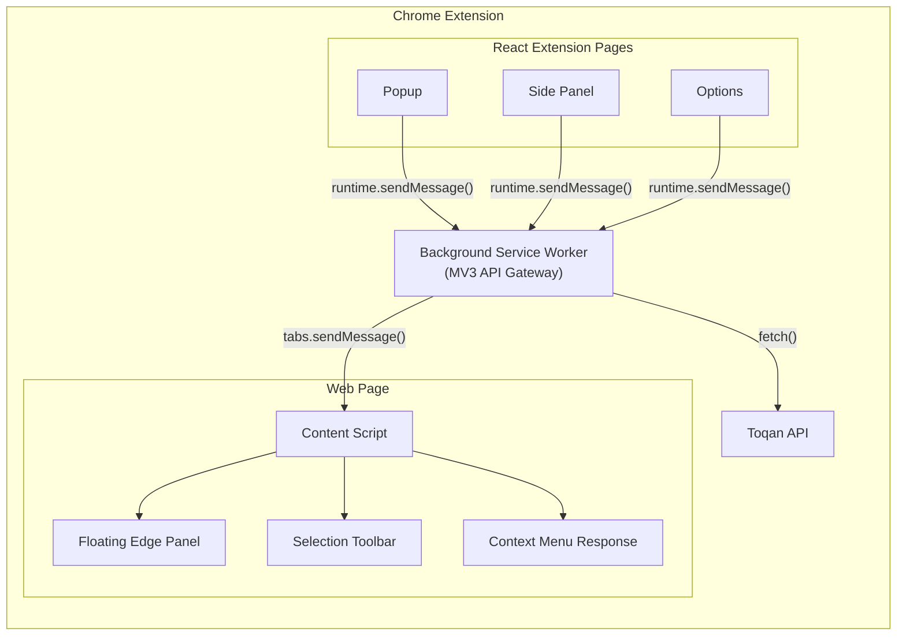
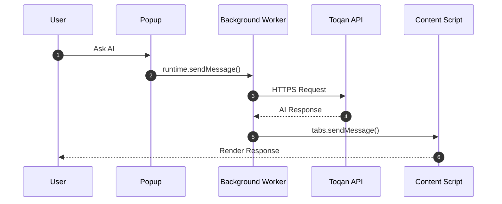
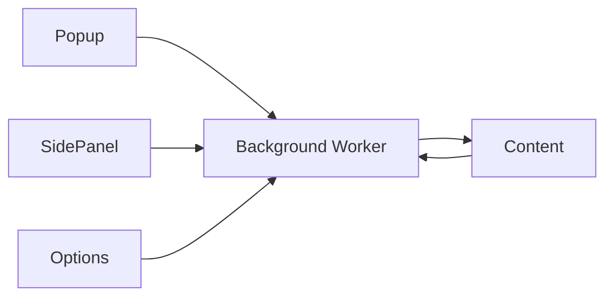
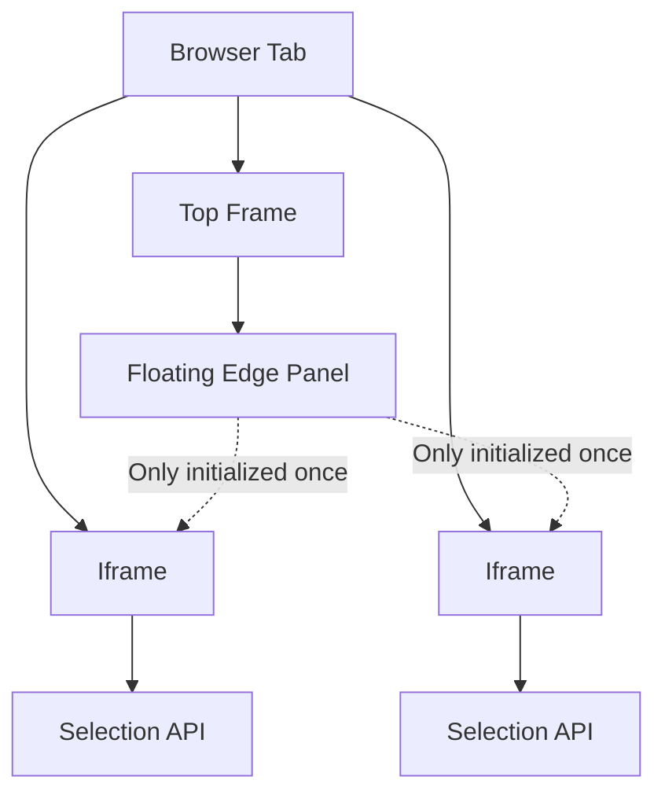
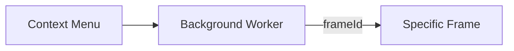
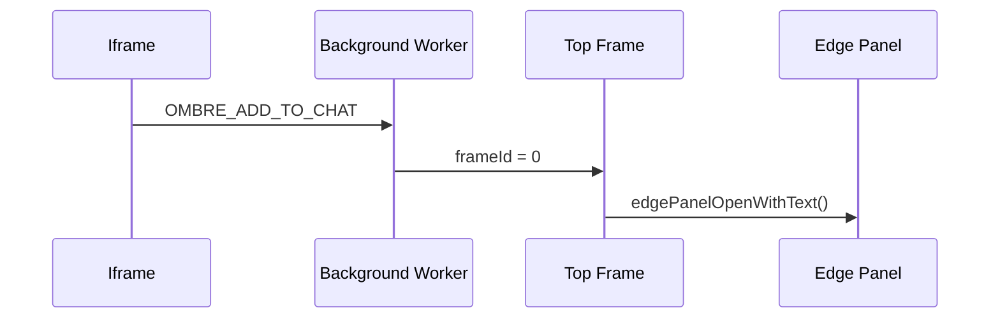
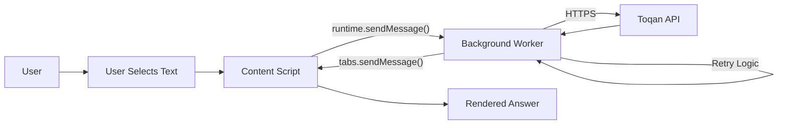

# 02 · System Architecture

> **Purpose**
>
> The Toqan Chrome Extension follows a **message-driven, service-oriented architecture** where every execution context communicates through the **Background Service Worker**. This creates a single networking boundary, centralizes API access, simplifies security, and provides a scalable foundation for future features.

---

# Architecture Principles

The extension is designed around a few core engineering principles.

| Principle | Description |
|-----------|-------------|
| Single API Gateway | Only the Background Service Worker communicates with the Toqan API. |
| Message-Driven | Components communicate through Chrome Runtime Messaging instead of direct dependencies. |
| Separation of Concerns | Every execution context has one clearly defined responsibility. |
| Frame Awareness | Supports text selection inside iframes while preventing duplicate UI. |
| Security | API keys, retry logic, authentication, and networking remain isolated from UI code. |
| Extensibility | New extension surfaces can be added without modifying networking logic. |

---

# High-Level Architecture

Every extension surface delegates API communication to the Background Service Worker.



---

# System Components

## React Extension Pages

The Popup, Side Panel, and Options page are responsible only for rendering user interfaces.

Responsibilities:

- Rendering UI
- Collecting user input
- Displaying responses
- Sending runtime messages

They never:

- call the Toqan API
- manage authentication
- store API secrets
- implement retry logic

---

## Background Service Worker

The Background Service Worker is the application's backend.

It owns all networking and cross-context communication.

Responsibilities include:

- API Gateway
- Authentication
- Retry Logic
- Exponential Backoff
- Request Validation
- Context Menu Events
- Runtime Messaging
- Cross-Frame Routing
- Tab Coordination
- Error Handling

Because every network request passes through this layer, future features such as request caching, analytics, telemetry, or offline queues can be added without changing any UI code.

---

## Content Script

The Content Script is responsible for interacting directly with web pages.

Responsibilities include:

- Reading selected text
- Rendering the floating edge panel
- Showing context-menu responses
- Displaying selection toolbar
- DOM interaction
- Sending runtime messages

The Content Script never communicates directly with the Toqan API.

---

# Runtime Communication

Every request flows through the Background Service Worker.



---

# Message Bus

The extension uses Chrome Runtime Messaging as its internal event bus.



Advantages:

- Loose coupling
- Centralized networking
- Easy testing
- Independent execution contexts
- Easier maintenance
- Strong separation of concerns

---

# Why the Content Script Runs in Every Frame

The extension enables:

```json
{
  "all_frames": true
}
```

Modern websites frequently place editable content inside iframes.

Examples include:

- Gmail compose
- Rich text editors
- Embedded applications
- Documentation previews
- CMS editors

Because the Selection API only works within the current browsing context,

```ts
window.getSelection()
```

cannot access selections from another frame.

Running the Content Script in every frame guarantees that selected text can always be captured.

---

# Frame Architecture



---

# Preventing Duplicate UI

Since the Content Script runs inside every frame, multiple floating panels would normally appear.

To prevent duplicate initialization, only the top browsing context creates UI.

```ts
if (window.self !== window.top) {
    return;
}
```

As a result:

- only one floating pill exists
- only one edge panel exists
- iframe instances remain lightweight
- text selection continues working everywhere

---

# Frame-Aware Messaging

Chrome normally broadcasts messages to every frame.

For text-selection workflows this would create duplicate responses.

Instead, messages target a specific frame.



The originating frame is obtained from:

```ts
info.frameId
```

Messages are forwarded using:

```ts
chrome.tabs.sendMessage(
    tabId,
    message,
    {
        frameId
    }
)
```

When the destination is always the main document, the extension uses:

```text
frameId = 0
```

---

# Cross-Context Bridges

Some actions originate inside an iframe while the chat interface only exists inside the top frame.

Two bridge mechanisms solve this problem.

---

## edgePanelOpenWithText

When already running in the top frame, the Content Script stores an in-memory function reference.

```text
edgePanelOpenWithText(text)
```

This allows direct invocation without unnecessary runtime messaging.

---

## OMBRE_ADD_TO_CHAT

When the action originates inside an iframe:



This relay guarantees that the chat interface remains centralized while still allowing every browsing context to contribute interactions.

---

# Complete Request Lifecycle

Every AI request follows the same execution pipeline.



---

# Component Responsibility Matrix

| Component | Primary Responsibility |
|------------|------------------------|
| Popup | User interaction |
| Side Panel | Persistent chat experience |
| Options | Extension configuration |
| Background Service Worker | Networking, authentication, routing, retries |
| Content Script | DOM interaction, selections, floating UI |
| Toqan API | AI inference and responses |

---

# Benefits of the Architecture

- Centralized networking
- Single source of truth for API communication
- Secure API key handling
- Clear separation of responsibilities
- Frame-aware message routing
- Easily testable components
- Scalable event-driven communication
- Future support for caching, telemetry, offline queues, and analytics
- Simplified maintenance as the extension grows

---

# Summary

The Toqan Chrome Extension is built around a **service-oriented, message-driven architecture** where the **Background Service Worker acts as the application's backend**.

React extension pages focus exclusively on user interfaces, while Content Scripts manage DOM interactions and browser integrations. All networking, authentication, request orchestration, and cross-context routing are centralized within the Background Service Worker.

This design provides a secure, maintainable, and highly scalable architecture that supports complex browser environments—including iframe-heavy websites—while remaining easy to extend with future capabilities such as caching, analytics, and offline support.

---

◀ **[01 · Tech Stack Selection](./01_Tech_Stack_Selection.md)** · **[Documentation Index](../README.md#documentation)** · **Next: [03 · API Endpoints](./03_API_Endpoints.md)** ▶