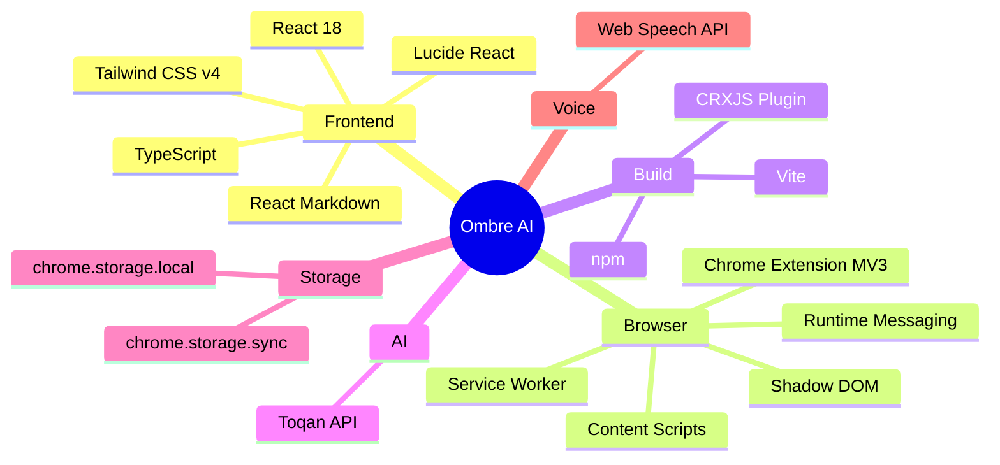
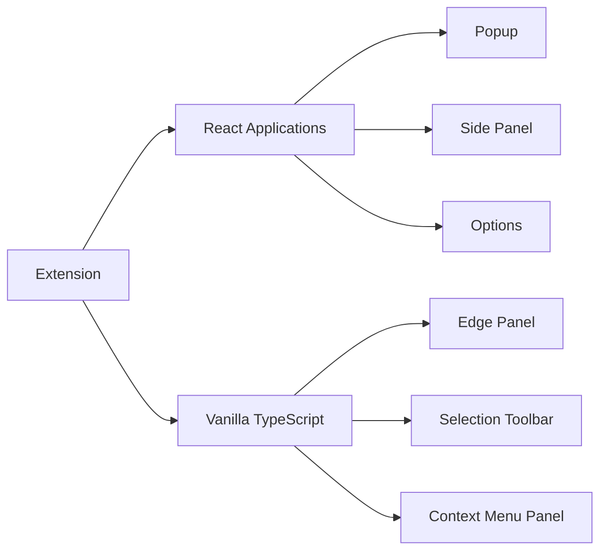
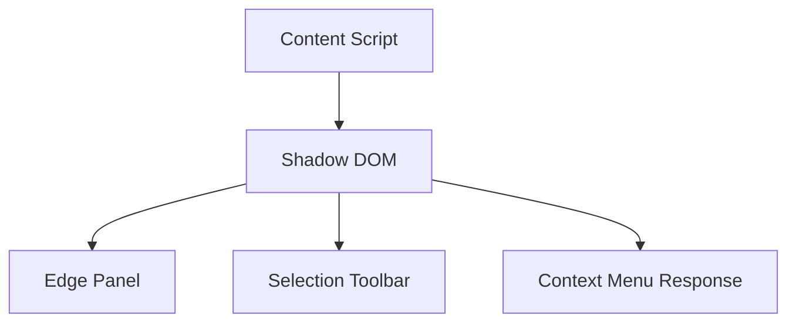
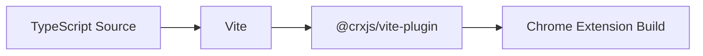
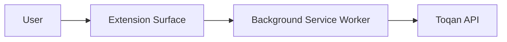
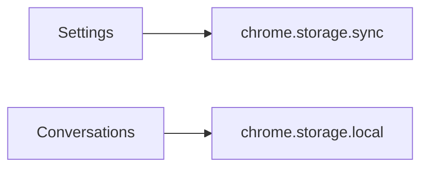

# 02 · Technology Stack

> **Purpose**
>
> Ombre AI intentionally uses multiple technologies, each selected for the environment in which it executes. Rather than applying a single framework everywhere, the project follows the principle of **using the right tool for the right execution context**. This results in a smaller, faster, and more maintainable extension while remaining scalable as the project grows.

---

# Technology Stack Overview



---

# Technology Decision Matrix

| Layer | Technology | Purpose |
|---------|------------|----------|
| Language | TypeScript | Strong typing, maintainability, and developer productivity |
| UI Framework | React 18 | Interactive extension pages |
| Styling | Tailwind CSS v4 | Utility-first styling with design tokens |
| Icons | Lucide React | Consistent iconography |
| Markdown | react-markdown + remark-gfm | Rich AI response rendering |
| Build Tool | Vite | Fast development and optimized production builds |
| Extension Integration | @crxjs/vite-plugin | Native Manifest V3 build pipeline |
| Browser APIs | Chrome Extension APIs | Runtime messaging, storage, tabs, context menus |
| AI Provider | Toqan API | Large language model inference |
| Voice Recognition | Web Speech API | Native speech-to-text |
| Persistence | chrome.storage | User settings and conversations |

---

# Frontend Architecture

Ombre AI intentionally uses **two frontend architectures**.

Rather than forcing every user interface into React, the project selects the technology that best fits the execution environment.



This separation minimizes runtime overhead while maintaining a consistent user experience.

---

# React Extension Pages

The extension's standalone pages are implemented using **React 18** and **TypeScript**.

These pages behave like traditional single-page applications and benefit from React's component model.

## Technologies

| Layer | Choice | Why |
|--------|--------|-----|
| Framework | React 18 | Component-based architecture for complex interfaces |
| Language | TypeScript | Compile-time safety and maintainability |
| Bundler | Vite | Fast development server and optimized production builds |
| Extension Plugin | @crxjs/vite-plugin | Native Chrome Extension support |
| Styling | Tailwind CSS v4 | Consistent design system |
| Icons | Lucide React | Lightweight SVG icon library |
| Markdown | react-markdown + remark-gfm | Full CommonMark and GitHub Flavored Markdown support |

---

## Why React?

React provides significant advantages for stateful interfaces such as:

- conversation history
- message rendering
- settings management
- reusable components
- keyboard interactions
- animations
- persistent application state

These interfaces behave similarly to traditional web applications, making React the natural choice.

---

# Content Script Architecture

Unlike the extension pages, the Content Script deliberately avoids React.



Instead, it uses lightweight, hand-written TypeScript.

---

# Why Not React?

This decision is intentional and based on engineering trade-offs rather than framework preference.

## 1. Performance

The Content Script executes on **every webpage** the user visits.

Additionally, the extension enables:

```json
{
  "all_frames": true
}
```

This means the script may run dozens of times on a single page.

Shipping React and ReactDOM into every browsing context would unnecessarily increase:

- memory usage
- JavaScript execution time
- bundle size
- page startup cost

Using vanilla TypeScript keeps the runtime footprint extremely small.

---

## 2. Shadow DOM Isolation

Every injected interface renders inside its own Shadow DOM.

```ts
element.attachShadow({
    mode: "open"
})
```

Benefits include:

- Host page styles cannot affect the extension.
- Extension styles cannot leak into the page.
- Predictable rendering.
- No CSS namespace collisions.
- Reliable behavior across arbitrary websites.

Because Shadow DOM already provides strong isolation, React's rendering abstraction offers limited additional value.

---

## 3. Simplicity

The injected interfaces are relatively small.

Examples include:

- floating toolbar
- edge panel
- inline response panel

These components consist primarily of:

- template literals
- event listeners
- DOM manipulation
- animations

A React component hierarchy would introduce unnecessary complexity compared to lightweight TypeScript.

---

# Accepted Trade-Off

Choosing vanilla TypeScript means the Content Script does not use:

- React
- ReactDOM
- react-markdown

Instead, the project includes a lightweight Markdown renderer supporting the formatting commonly returned by the Toqan API.

Supported formatting includes:

- headings
- bold
- italic
- inline code
- lists
- numbered lists
- paragraph spacing

This significantly reduces dependencies while preserving a high-quality reading experience.

---

# Build System



---

## Vite

Vite provides:

- instant development server
- fast Hot Module Replacement (HMR)
- optimized production builds
- native TypeScript support

---

## CRXJS

The project uses **@crxjs/vite-plugin** to integrate with Chrome Extension development.

Responsibilities include:

- Manifest V3 processing
- Content Script generation
- Service Worker bundling
- Asset management
- Web Accessible Resources generation

This removes much of the boilerplate normally required for extension development.

---

# Styling

The project uses **Tailwind CSS v4** as its design system.

Advantages include:

- utility-first styling
- consistent spacing
- reusable design tokens
- dark theme support
- minimal generated CSS

The design language is based on OKLCH color tokens, providing perceptually consistent colors across all extension surfaces.

---

# Icons

The interface uses **Lucide React**.

Reasons for selection:

- lightweight
- tree-shakeable
- consistent stroke design
- excellent TypeScript support
- large icon library

---

# AI Integration



The extension communicates with the **Toqan API** through the Background Service Worker.

Communication follows a polling workflow:

```text
create_conversation
        ↓
conversation_id
        ↓
get_answer
        ↓
AI response
```

Centralizing API communication simplifies:

- authentication
- retry logic
- request validation
- error handling
- future caching

---

# Voice Recognition

Voice input is implemented using the browser's native **Web Speech API**.

Technologies:

- `SpeechRecognition`
- `webkitSpeechRecognition`

Advantages include:

- native browser implementation
- no third-party SDK
- no additional infrastructure
- low latency
- minimal dependencies

Audio processing is handled by the browser's built-in speech recognition service.

---

# Data Persistence



Different storage mechanisms are selected based on the characteristics of the data.

| Storage | Purpose | Reason |
|----------|---------|--------|
| `chrome.storage.sync` | API key and user preferences | Small data that should synchronize across signed-in Chrome profiles |
| `chrome.storage.local` | Conversation history | Larger data that should avoid synchronization quotas |

This separation improves performance while respecting Chrome's storage limitations.

---

# Browser APIs

The extension relies extensively on Chrome's extension APIs.

| API | Purpose |
|------|----------|
| Runtime Messaging | Communication between execution contexts |
| Tabs | Frame-aware messaging |
| Context Menus | Right-click AI actions |
| Storage | User settings and conversations |
| Side Panel | Persistent AI workspace |
| Commands | Keyboard shortcuts |
| Service Worker | Background execution |

---

# Engineering Trade-Offs

| Decision | Benefit | Trade-Off |
|-----------|---------|-----------|
| React only where needed | Smaller runtime footprint | Two UI architectures |
| Shadow DOM | Complete CSS isolation | Slightly more DOM complexity |
| Polling API | Simple implementation | Responses are not streamed |
| Native Speech API | No extra dependencies | Browser compatibility differences |
| Local conversation storage | Better performance | Conversations do not sync across devices |

---

# Summary

Ombre AI deliberately combines multiple technologies rather than relying on a single framework across every execution context.

React powers the extension's application-like interfaces, while lightweight TypeScript and Shadow DOM provide efficient browser-integrated experiences. Combined with Vite, CRXJS, Tailwind CSS, and the Toqan API, this architecture delivers a performant, maintainable, and scalable foundation for a modern AI-powered Chrome Extension.

---

◀ **[01 · Project Overview](./01_Project_Overview.md)** · **[Documentation Index](../README.md#documentation)** · **Next: [03 · System Architecture](./03_System_Architecture.md)** ▶